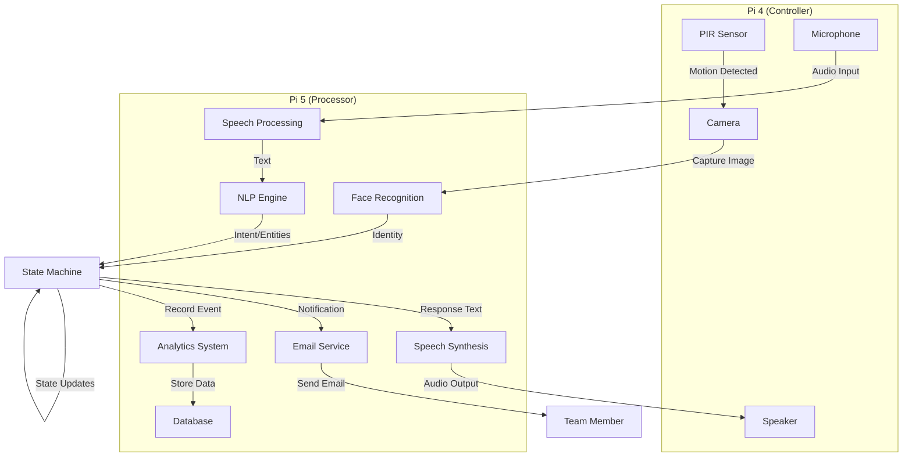
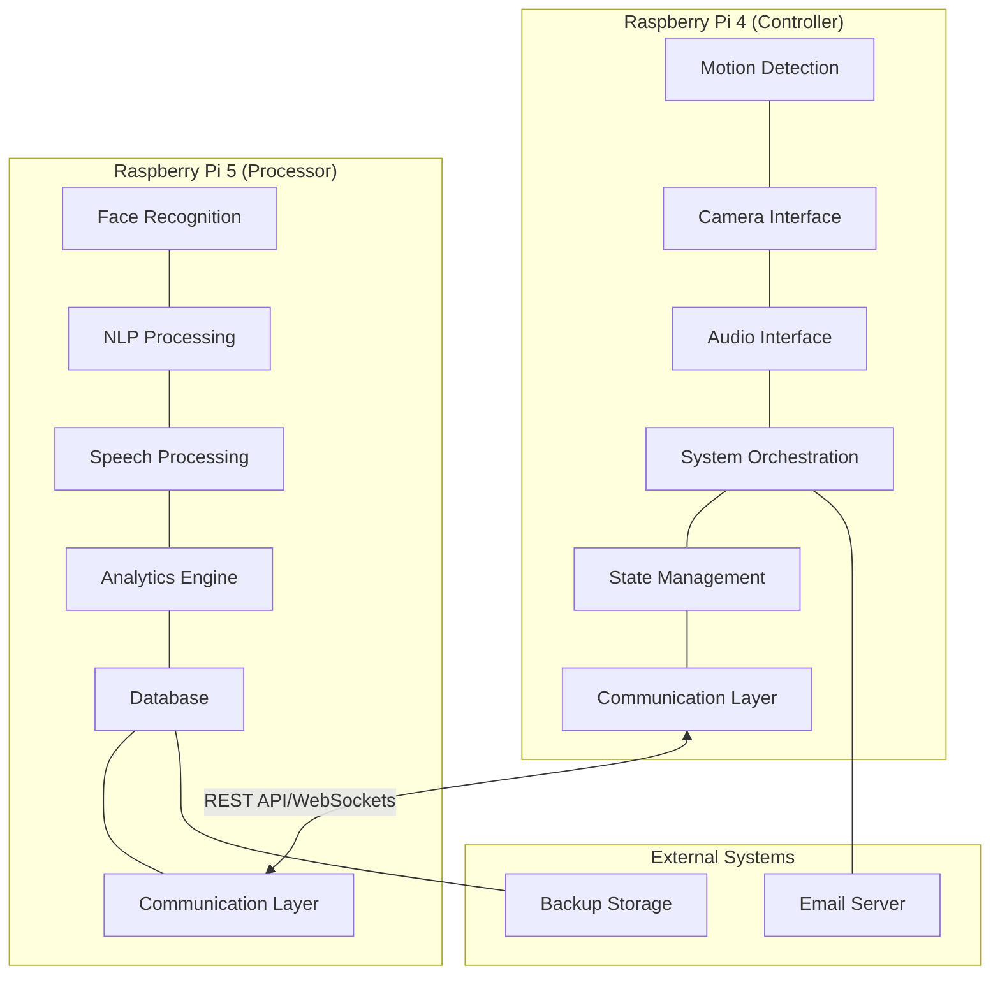

# Badr AI Receptionist - System Architecture

This document provides an overview of the Badr AI Receptionist system architecture.

## System Components

The Badr AI Receptionist system consists of the following main components:

### 1. Hardware Components

#### Primary Hardware (Raspberry Pi 4B)
- **Raspberry Pi 4B**: The main controller for hardware interfaces and real-time interactions
- **Raspberry Pi Camera Module 3 Noir**: For capturing images and video
- **USB PnP Audio Device**: For audio input and output
- **PIR Sensor**: Connected to GPIO 27 for motion detection

#### Processing Hardware (Optional)
- **Raspberry Pi 5**: Additional processing unit for computationally intensive tasks
- **1TB SSD**: Extended storage for video recordings and analytics data

### 2. Software Components

- **Face Recognition System**: Identifies visitors and team members
- **Natural Language Processing Engine**: Understands intent and generates responses
- **Speech Processing System**: Handles voice interaction in English and Arabic
- **State Machine**: Manages conversation flow and system states
- **Integration Components**: Connects with email and notification systems
- **System Management**: Monitors system health and manages resources
- **Distributed Communication**: Handles communication between Pi 4 and Pi 5 (when applicable)

## System Architectures

Badr AI Receptionist supports two deployment architectures:

### Single-Device Architecture

In this configuration, all components run on a single Raspberry Pi 4B.

### Distributed Architecture

In this advanced configuration, the system is distributed across two devices:

- **Raspberry Pi 4 (Controller)**: Handles hardware interfaces, motion detection, camera capture, audio I/O, and system orchestration
- **Raspberry Pi 5 (Processor)**: Handles computationally intensive tasks like face recognition, NLP, speech processing, and analytics

The distributed architecture provides several benefits:
- Improved performance for AI-intensive tasks
- Better responsiveness for real-time interactions
- Enhanced reliability through component isolation
- Increased storage capacity for video recordings and analytics data

## System Workflow

1. **Idle State**: The system is in idle state, waiting for motion detection
2. **Motion Detection**: When motion is detected, the system activates the camera
3. **Face Recognition**: The system captures an image and attempts to identify the person
4. **Greeting**: If the person is recognized, the system greets them by name
5. **Conversation**: The system engages in conversation, understanding intent and generating responses
6. **Action**: Based on the conversation, the system takes appropriate action (scheduling appointment, providing information, etc.)
7. **Notification**: The system notifies team members as needed
8. **Conclusion**: The conversation ends, and the system returns to idle state

## Data Flow

## System Architecture Diagram

## Communication Protocol

In the distributed architecture, the Pi 4 and Pi 5 communicate using:

1. **REST API**: For non-real-time communication and task delegation
   - Task delegation (face recognition, NLP processing, etc.)
   - Configuration synchronization
   - Health checks and status monitoring

2. **WebSockets**: For real-time events and notifications
   - Motion detection events
   - Face recognition results
   - State synchronization

## System Management and Fail-Safes

The system includes robust management and fail-safe mechanisms:

1. **Health Monitoring**: Continuous monitoring of:
   - Disk space usage
   - Memory usage
   - CPU usage
   - Network connectivity
   - Peer device connectivity

2. **Automatic Recovery**: The system can recover from various failure scenarios:
   - If the Pi 5 becomes unavailable, the Pi 4 can continue to operate in a degraded mode
   - If the network connection is lost, the Pi 4 will continue to function locally
   - If a crash occurs, the system will automatically restart

3. **Resource Management**: The system efficiently manages resources:
   - Video storage with tiered retention policies
   - Automatic cleanup of old data
   - Backup procedures for critical data

## Security Considerations

- Face data is stored securely and is not accessible outside the system
- All communication between devices is encrypted
- The system does not store conversation data beyond what is necessary for the current interaction
- Access to the system is restricted to authorized personnel
- Regular security updates are applied to all components

---

Powered by Cognitara (c) 2025
