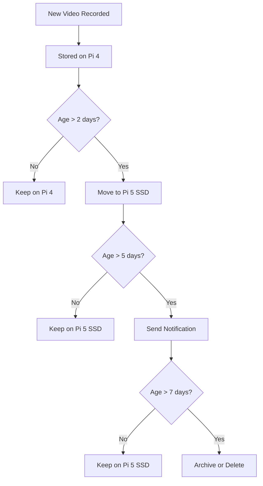

# Badr AI Backup System

This document provides comprehensive information about the backup system implemented for the Badr AI Receptionist project.

## Overview

The backup system provides multiple types of backups:

1. **Local Backups**: Daily backups stored on the local machine
2. **Google Drive Backups**: Weekly backups stored in Google Drive
3. **Distributed Backups**: Synchronized backups between Pi 4 and Pi 5 (when using distributed architecture)
4. **Video Storage Management**: Tiered storage system for video recordings

## Backup Scripts

The following scripts are available in the `scripts` directory:

### 1. local_backup.sh

Creates a local backup of the Badr AI project.

- **Frequency**: Daily at 1:00 AM (when scheduled)
- **Location**: `/home/pi/Backups/Badr/`
- **Retention**: Keeps the 5 most recent backups
- **Log File**: `/home/pi/local_backup.log`

**Manual Execution**:
```bash
./scripts/local_backup.sh
```

### 2. gdrive_backup.sh

Creates a backup and uploads it to Google Drive.

- **Frequency**: Weekly on Sunday at 2:00 AM (when scheduled)
- **Location**: Google Drive folder `BadrBackups`
- **Account**: info.cognitrara@gmail.com
- **Log File**: `/home/pi/gdrive_backup.log`

**Manual Execution**:
```bash
./scripts/gdrive_backup.sh
```

### 3. backup.sh

Master script that runs both local and Google Drive backups.

**Manual Execution**:
```bash
./scripts/backup.sh
```

### 4. verify_backups.sh

Verifies the integrity of both local and Google Drive backups.

- **Frequency**: Daily at 3:00 AM (when scheduled)
- **Log File**: `/home/pi/verify_backup.log`

**Manual Execution**:
```bash
./scripts/verify_backups.sh
```

### 5. setup_backup_cron.sh

Sets up automated backup schedule using cron.

**Manual Execution**:
```bash
./scripts/setup_backup_cron.sh
```

### 6. sync_pi5.sh

Synchronizes critical data between Pi 4 and Pi 5 in the distributed architecture.

- **Frequency**: Hourly (when scheduled)
- **Log File**: `/home/pi/sync_pi5.log`

**Manual Execution**:
```bash
./scripts/sync_pi5.sh
```

### 7. manage_videos.sh

Manages video storage according to the tiered storage policy.

- **Frequency**: Daily at 4:00 AM (when scheduled)
- **Log File**: `/home/pi/manage_videos.log`

**Manual Execution**:
```bash
./scripts/manage_videos.sh
```

## Video Storage Management

The system implements a tiered storage policy for video recordings:



### Tiered Storage Policy

1. **Tier 1 (0-2 days)**: Videos stored on Pi 4 local storage
   - Immediately accessible for recent interactions
   - Automatically tagged with metadata (date, time, recognized faces)

2. **Tier 2 (3-7 days)**: Videos moved to Pi 5 SSD
   - More efficient long-term storage
   - Indexed for quick retrieval
   - Notification sent on day 5 with video count and size

3. **Tier 3 (After 7 days)**:
   - Videos are either archived to Google Drive or deleted based on configuration
   - Metadata is retained for analytics purposes

### Video Management Features

- **Automatic Cleanup**: Prevents storage from filling up
- **Selective Retention**: Important videos can be flagged for extended retention
- **Metadata Preservation**: Even when videos are deleted, metadata is retained for analytics
- **Compression**: Older videos are compressed to save space

## Distributed Backup System

When using the distributed architecture with Pi 4 and Pi 5, the backup system is enhanced:

### Pi 4 Backup Components

- Configuration files
- Face recognition data
- System logs
- Recent video recordings (0-2 days)

### Pi 5 Backup Components

- Database
- Analytics data
- Older video recordings (3+ days)
- Machine learning models

### Synchronization Process

The system maintains synchronization between devices:

1. **Critical Data Sync**: Configuration and state information is synchronized hourly
2. **Database Backup**: The Pi 5 database is backed up to Pi 4 daily
3. **Failover Preparation**: Essential files for failover operation are kept updated on both devices

## Initial Setup

### 1. Google Drive Setup

Before using Google Drive backups, you need to configure rclone:

1. Install rclone:
   ```bash
   sudo apt install rclone
   ```

2. Configure rclone for Google Drive:
   ```bash
   rclone config
   ```

3. Follow the prompts:
   - Choose `n` for new remote
   - Name: `badr_gdrive`
   - Type: `drive`
   - Client ID: (leave blank)
   - Client Secret: (leave blank)
   - Scope: `1` (full access)
   - Root folder ID: (leave blank)
   - Service account file: (leave blank)
   - Auto config: `y`
   - Team drive: `n`

4. A browser window will open. Log in with info.cognitrara@gmail.com and grant access.

### 2. Set Up Automated Backups

Run the setup script to configure automated backups:

```bash
./scripts/setup_backup_cron.sh
```

This will set up the following schedule:
- Local backup: Daily at 1:00 AM
- Google Drive backup: Weekly on Sunday at 2:00 AM
- Backup verification: Daily at 3:00 AM
- Video management: Daily at 4:00 AM
- Pi 5 synchronization: Hourly (if distributed architecture is enabled)

## Backup Restoration

### Restoring from Local Backup

1. Find the backup file in `/home/pi/Backups/Badr/`
2. Extract the backup:
   ```bash
   tar -xzf /home/pi/Backups/Badr/badr_backup_YYYYMMDD_HHMMSS.tar.gz -C /path/to/restore
   ```

### Restoring from Google Drive Backup

1. List available backups:
   ```bash
   rclone ls badr_gdrive:BadrBackups
   ```

2. Download the backup:
   ```bash
   rclone copy badr_gdrive:BadrBackups/badr_backup_YYYYMMDD_HHMMSS.tar.gz /tmp/
   ```

3. Extract the backup:
   ```bash
   tar -xzf /tmp/badr_backup_YYYYMMDD_HHMMSS.tar.gz -C /path/to/restore
   ```

### Restoring a Distributed System

When restoring a distributed system:

1. Restore the Pi 4 (Controller) first:
   ```bash
   ./scripts/restore_pi4.sh /path/to/backup/file.tar.gz
   ```

2. Restore the Pi 5 (Processor):
   ```bash
   ./scripts/restore_pi5.sh /path/to/backup/file.tar.gz
   ```

3. Verify the connection between devices:
   ```bash
   ./scripts/verify_distributed.sh
   ```

## Troubleshooting

### Local Backup Issues

- Check disk space: `df -h`
- Check backup log: `cat /home/pi/local_backup.log`
- Verify backup directory exists: `ls -la /home/pi/Backups/Badr/`

### Google Drive Backup Issues

- Check rclone configuration: `rclone config show badr_gdrive`
- Test rclone connection: `rclone lsd badr_gdrive:`
- Check backup log: `cat /home/pi/gdrive_backup.log`
- Verify internet connection: `ping -c 4 google.com`

### Distributed Backup Issues

- Check Pi 5 connectivity: `ping -c 4 <PI5_IP>`
- Check synchronization log: `cat /home/pi/sync_pi5.log`
- Verify SSH key authentication: `ssh -i ~/.ssh/id_rsa_pi5 <PI5_USER>@<PI5_IP> echo "Connected"`
- Check disk space on Pi 5: `ssh <PI5_USER>@<PI5_IP> df -h`

### Video Storage Issues

- Check video management log: `cat /home/pi/manage_videos.log`
- Verify video directory structure: `ls -la /home/pi/Badr/data/videos/`
- Check video metadata database: `sqlite3 /home/pi/Badr/data/video_metadata.db .tables`

### Cron Job Issues

- Check if cron is running: `systemctl status cron`
- View cron jobs: `crontab -l`
- Check system logs: `grep CRON /var/log/syslog`

---

Powered by Cognitara (c) 2025
