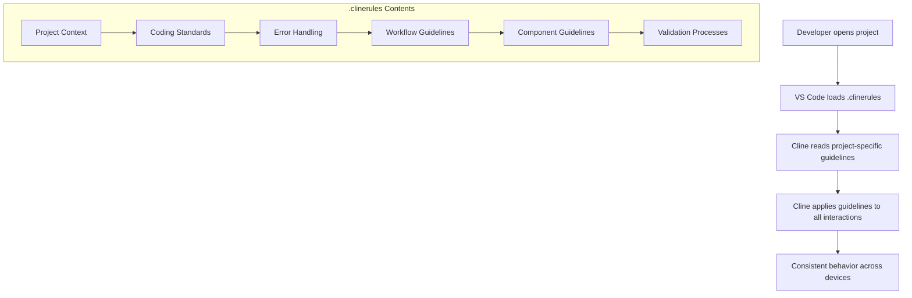
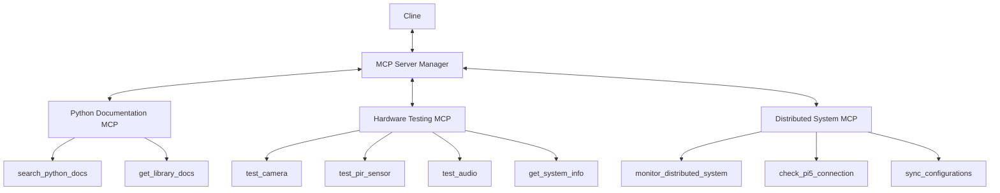

# Cline Enhancements for Badr AI Receptionist

This document provides information about the Cline enhancements implemented for the Badr AI Receptionist project. These enhancements improve cross-platform consistency, error reduction, and extend Cline's capabilities through MCP servers.

> **Note:** Cline is an AI assistant created by [Anthropic](https://www.anthropic.com/). This document describes custom enhancements implemented for the Badr AI Receptionist project to extend Cline's capabilities.

## Table of Contents

1. [Cross-Platform Consistency](#cross-platform-consistency)
2. [Error Reduction & Code Validation](#error-reduction--code-validation)
3. [MCP Extensions](#mcp-extensions)
4. [Distributed Architecture Support](#distributed-architecture-support)
5. [Setup Instructions](#setup-instructions)
6. [Usage Guide](#usage-guide)

## Cross-Platform Consistency

The following enhancements ensure consistent behavior across different development environments:

### .clinerules File

A comprehensive `.clinerules` file has been created in the project root directory. This file provides Cline with project-specific knowledge and guidelines, including:

- Project context and hardware platform details
- Coding standards and documentation requirements
- Error handling and testing requirements
- Development workflow guidelines
- Component-specific guidelines
- Reasoning and validation processes

The `.clinerules` file ensures that Cline follows the same rules and guidelines regardless of which device you're using.



### VS Code Settings

VS Code settings have been configured to ensure consistent editor behavior:

- Editor settings (formatting, rulers, tab size, etc.)
- File settings (exclusions, watchers, etc.)
- Python settings (linting, formatting, type checking, etc.)
- Testing settings (pytest configuration)
- Terminal settings
- Git settings
- Cline-specific settings

These settings are stored in the `.vscode/settings.json` file.

### VS Code Extensions

Recommended VS Code extensions are specified in the `.vscode/extensions.json` file, ensuring that all developers have the same tools available.

### Environment Sync

A sync script (`scripts/sync_environment.sh`) has been created to help maintain consistency between different development environments. This script:

- Creates a backup of project settings
- Generates a report of installed extensions
- Documents environment configuration
- Creates a restore script for easy setup on another device

## Error Reduction & Code Validation

The following enhancements help reduce errors and improve code quality:

### Enhanced Validation Rules

The `.clinerules` file includes enhanced validation rules that require Cline to:

- Verify understanding of requirements before implementation
- Consider alternative approaches
- Identify potential edge cases and failure modes
- Think about performance implications
- Consider security and privacy aspects

### Self-Review Process

Cline is instructed to follow a self-review process after writing code:


This systematic review process helps catch issues before they make it into the codebase, resulting in higher quality code with fewer bugs.

### Testing Framework

A comprehensive testing framework has been set up with:

- Unit tests for individual components
- Integration tests for component interactions
- System tests for end-to-end workflows
- Performance tests for system performance

The testing framework is configured in `pytest.ini` and includes test fixtures in `tests/conftest.py`.

## MCP Extensions

Model Context Protocol (MCP) servers have been implemented to extend Cline's capabilities:



### Python Documentation MCP

This MCP server allows Cline to search Python documentation and get information about Python libraries. It provides two tools:

- `search_python_docs`: Search Python documentation for a module, class, or function
- `get_library_docs`: Get documentation for a Python library

### Hardware Testing MCP

This MCP server allows Cline to test and interact with Raspberry Pi hardware. It provides four tools:

- `test_camera`: Test the Raspberry Pi camera
- `test_pir_sensor`: Test the PIR motion sensor
- `test_audio`: Test the audio device
- `get_system_info`: Get Raspberry Pi system information

### Distributed System MCP

This new MCP server enables Cline to interact with the distributed architecture of Badr AI Receptionist. It provides tools for:

- `monitor_distributed_system`: Check the health of both Pi 4 and Pi 5
- `check_pi5_connection`: Verify connectivity with the Pi 5
- `sync_configurations`: Ensure configurations are synchronized between devices

## Distributed Architecture Support

Cline has been enhanced to support the distributed architecture of Badr AI Receptionist, which uses Raspberry Pi 4 and Raspberry Pi 5 devices:

- **Pi 4 (Controller)**: Handles hardware interfaces, motion detection, camera capture, audio I/O
- **Pi 5 (Processor)**: Handles computationally intensive tasks like face recognition, NLP, speech processing

Cline can now:

- Generate code that works across the distributed architecture
- Understand the component distribution between devices
- Implement appropriate communication mechanisms
- Provide guidance on system management and fail-safes
- Help with troubleshooting distributed system issues

## Setup Instructions

Follow these instructions to set up the Cline enhancements:

### 1. Environment Sync

To set up environment synchronization:

```bash
# Make the script executable
chmod +x scripts/sync_environment.sh

# Run the script
./scripts/sync_environment.sh
```

This will create a backup of your project settings, generate a report of installed extensions, and create a restore script.

### 2. MCP Servers

To set up the MCP servers:

```bash
# Make the script executable
chmod +x scripts/setup_mcp_servers.sh

# Run the script
./scripts/setup_mcp_servers.sh
```

This will set up the Python Documentation, Hardware Testing, and Distributed System MCP servers and configure Cline to use them.

### 3. Testing Framework

To set up the testing framework:

```bash
# Make the script executable
chmod +x scripts/setup_testing.sh

# Run the script
./scripts/setup_testing.sh
```

This will install the necessary testing dependencies and configure VS Code for testing.

## Usage Guide

### Using .clinerules

The `.clinerules` file is automatically loaded by Cline when you open the project in VS Code. You don't need to do anything special to use it.

### Using VS Code Settings

The VS Code settings are automatically applied when you open the project in VS Code. You don't need to do anything special to use them.

### Using Environment Sync

To create a backup of your environment:

```bash
./scripts/sync_environment.sh
```

To restore your environment on another device:

```bash
./environment_backups/restore_env.sh
```

### Using MCP Servers

Once the MCP servers are set up, you can use them in Cline by asking questions like:

- "Search Python documentation for the 'os' module"
- "Get documentation for the 'numpy' library"
- "Test the Raspberry Pi camera"
- "Get system information for the Raspberry Pi"
- "Check the connection to the Pi 5"
- "Monitor the distributed system health"

### Using the Testing Framework

To run tests:

```bash
# Run all tests
python -m pytest

# Run specific test categories
python -m pytest tests/unit
python -m pytest tests/integration
python -m pytest tests/system
python -m pytest tests/performance

# Run tests with coverage report
python -m pytest --cov=app --cov-report=html

# Run tests with continuous monitoring
pytest-watch -- tests/
```

You can also use the VS Code Testing view (flask icon in the activity bar) to run and debug tests.

---

Powered by Cognitara (c) 2025
