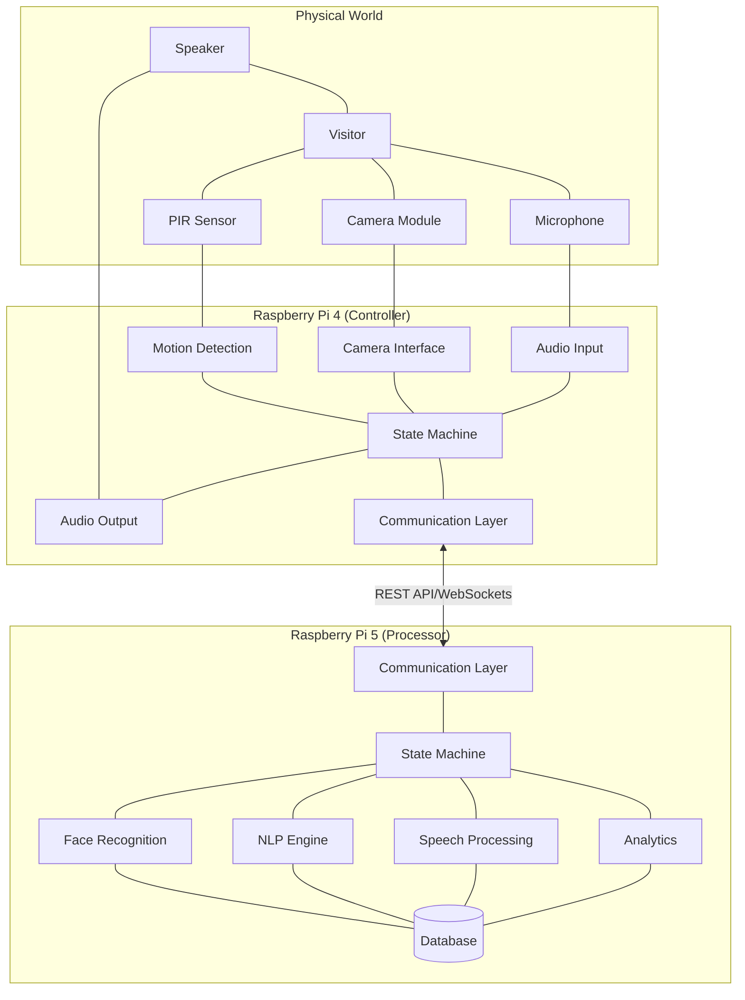

# Badr AI Receptionist - Distributed Architecture

This document provides a comprehensive overview of the distributed architecture implementation for the Badr AI Receptionist system.

## Overview

The Badr AI Receptionist distributed architecture leverages two Raspberry Pi devices to create a more powerful and responsive system:

- **Raspberry Pi 4 (Controller)**: Handles hardware interfaces, motion detection, camera capture, audio I/O, and system orchestration
- **Raspberry Pi 5 (Processor)**: Handles computationally intensive tasks like face recognition, NLP, speech processing, and analytics

This architecture provides several key benefits:
- **Improved Performance**: Offloads intensive processing tasks to the more powerful Pi 5
- **Enhanced Responsiveness**: Allows the Pi 4 to focus on real-time interactions
- **Better Reliability**: Isolates components to prevent system-wide failures
- **Increased Storage**: Utilizes the Pi 5's 1TB SSD for video storage and analytics data
- **Future Expandability**: Creates a foundation for adding more capabilities

## Component Distribution

The system components are distributed between the two devices based on their computational requirements and hardware dependencies:

| Component | Pi 4 (Controller) | Pi 5 (Processor) | Rationale |
|-----------|-------------------|------------------|-----------|
| Motion Detection | ✅ | ❌ | Hardware-dependent (PIR sensor) |
| Camera Capture | ✅ | ❌ | Hardware-dependent (camera module) |
| Audio I/O | ✅ | ❌ | Hardware-dependent (audio device) |
| Face Recognition | ❌ | ✅ | Computationally intensive |
| NLP Processing | ❌ | ✅ | Computationally intensive |
| Speech Processing | ❌ | ✅ | Computationally intensive |
| State Machine | ✅ | ✅ | Synchronized between devices |
| Email Notifications | ✅ | ❌ | Network-dependent |
| Video Recording | ✅ | ❌ | Hardware-dependent |
| Analytics | ❌ | ✅ | Computationally intensive |
| Database | ❌ | ✅ | Centralized storage |

## System Architecture

## Communication Protocol

The Pi 4 and Pi 5 communicate using a combination of protocols:

### REST API (for most operations)

Used for:
- Task delegation (face recognition, NLP processing, etc.)
- Configuration synchronization
- Health checks and status monitoring

Example endpoints:
- `/api/face/identify`: Send an image for face recognition
- `/api/nlp/process`: Process text for intent recognition
- `/api/speech/synthesize`: Convert text to speech
- `/api/system/health`: Check system health

### WebSockets (for real-time events)

Used for:
- Motion detection events
- Face recognition results
- State synchronization
- System alerts

This bidirectional communication channel ensures that both devices maintain a consistent state and can react quickly to events.

## Data Flow

The distributed architecture follows a clear data flow pattern:

1. **Sensor Data Collection** (Pi 4):
   - Motion detection via PIR sensor
   - Image capture via camera module
   - Audio input via microphone

2. **Data Transmission** (Pi 4 → Pi 5):
   - Images are compressed before transmission
   - Audio is encoded efficiently
   - Metadata is included with each transmission

3. **Data Processing** (Pi 5):
   - Face recognition on captured images
   - Speech-to-text conversion of audio
   - NLP processing of text
   - Intent determination and response generation

4. **Result Transmission** (Pi 5 → Pi 4):
   - Recognition results
   - Generated responses
   - Action recommendations

5. **Response Execution** (Pi 4):
   - Text-to-speech conversion
   - Audio output via speaker
   - Email notifications
   - State updates

## System Management

The distributed architecture includes robust system management capabilities:

### Health Monitoring

Both devices continuously monitor:
- Disk space usage
- Memory usage
- CPU usage
- Network connectivity
- Peer device connectivity

When thresholds are exceeded, the system takes appropriate actions:
- Sending notifications
- Cleaning up old data
- Adjusting processing parameters
- Initiating recovery procedures

### Fault Tolerance

The system is designed to handle various failure scenarios:

1. **Pi 5 Unavailable**:
   - Pi 4 detects connection loss
   - Pi 4 switches to local processing mode (degraded capabilities)
   - Periodic reconnection attempts
   - Notification sent to administrators

2. **Network Issues**:
   - Connection monitoring with automatic recovery
   - Buffering of data during connection loss
   - Synchronization upon reconnection

3. **Application Crashes**:
   - Watchdog processes monitor application health
   - Automatic restart of failed components
   - Logging of crash information for diagnosis

### Resource Management

The system efficiently manages resources:

1. **Video Storage**:
   - Tiered storage policy based on age
   - Automatic transfer of older videos to long-term storage
   - Cleanup of oldest videos when space is needed

2. **Database Management**:
   - Regular optimization and cleanup
   - Automatic backups
   - Performance monitoring

## Setup Process

The distributed architecture can be set up using the following high-level process:

1. **Pi 4 Setup**:
   - Install Badr AI Receptionist software
   - Configure hardware components
   - Set up network connectivity

2. **Pi 5 Setup**:
   - Install Raspberry Pi OS
   - Install required dependencies
   - Configure network connectivity

3. **Connection Setup**:
   - Configure Pi 4 with Pi 5's IP address
   - Configure Pi 5 with Pi 4's IP address
   - Test connectivity between devices

4. **System Configuration**:
   - Configure component distribution
   - Set up communication parameters
   - Configure system management settings

5. **Testing**:
   - Test individual components
   - Test communication between devices
   - Test fault tolerance mechanisms
   - Test end-to-end workflows

## Future Enhancements

The distributed architecture is designed to be extensible. Future enhancements may include:

1. **Load Balancing**: Dynamically adjust task distribution based on system load
2. **Redundancy**: Add failover capabilities for critical components
3. **Scaling**: Add support for additional processing nodes
4. **Remote Management**: Add a web interface for managing the distributed system
5. **Enhanced Analytics**: Leverage the Pi 5's power for more sophisticated analytics

---

Powered by Cognitara (c) 2025
