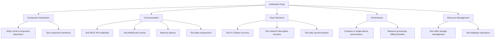

# Badr AI Receptionist Testing Framework

This document outlines the systematic testing approach for the Badr AI Receptionist project.

## Testing Philosophy

Our testing approach is based on the following principles:

1. **Comprehensive Coverage**: Test all components and their interactions
2. **Automation**: Automate tests where possible to ensure consistency
3. **Real-world Validation**: Supplement automated tests with real-world testing
4. **Continuous Improvement**: Use test results to drive improvements
5. **Distributed Testing**: Test both single-device and distributed architectures

## Test Types

### 1. Unit Tests

Tests for individual components in isolation.

- **Face Recognition Tests**: Verify recognition accuracy with different images
- **NLP Tests**: Validate intent detection and response generation
- **Hardware Interface Tests**: Ensure proper interaction with physical components
- **State Machine Tests**: Verify correct state transitions
- **Communication Tests**: Validate data serialization and transmission

### 2. Integration Tests

Tests for interactions between components.

- **Face Recognition + Notification**: Verify notifications are sent when faces are recognized
- **Motion Detection + Camera**: Ensure camera activates when motion is detected
- **Speech + NLP**: Validate speech input is correctly processed by NLP
- **NLP + Response Generation**: Verify appropriate responses are generated
- **Pi 4 + Pi 5 Communication**: Test data exchange between devices

### 3. System Tests

End-to-end tests of the entire system.

- **Visitor Scenarios**: Simulate complete visitor interactions
- **Appointment Scheduling**: Test full appointment scheduling workflow
- **Error Handling**: Verify system recovers from various error conditions
- **Long-running Tests**: Ensure stability over extended periods
- **Distributed Operation**: Test full system operation across Pi 4 and Pi 5

### 4. Performance Tests

Tests for system performance under various conditions.

- **Load Testing**: Verify system handles multiple interactions
- **Resource Usage**: Monitor CPU, memory, and disk usage
- **Response Time**: Measure time to respond to various inputs
- **Concurrent Operations**: Test multiple operations happening simultaneously
- **Network Performance**: Measure data transfer rates between Pi 4 and Pi 5

### 5. Distributed Architecture Tests

Specific tests for the distributed architecture.



## Test Environment Setup

### VSCode Testing Integration

1. **Install Python Test Explorer Extension**:
   ```bash
   code --install-extension littlefoxteam.vscode-python-test-adapter
   ```

2. **Configure Test Discovery**:
   Create `.vscode/settings.json` with:
   ```json
   {
     "python.testing.pytestEnabled": true,
     "python.testing.unittestEnabled": false,
     "python.testing.nosetestsEnabled": false,
     "python.testing.pytestArgs": [
       "tests"
     ]
   }
   ```

3. **Install Testing Dependencies**:
   ```bash
   pip install pytest pytest-cov pytest-xdist pytest-html pytest-timeout
   ```

## Test Directory Structure

```
/tests
  /unit                  # Unit tests
    /face_recognition    # Face recognition tests
    /nlp                 # NLP tests
    /hardware            # Hardware interface tests
    /core                # Core functionality tests
    /communication       # Communication tests
  /integration           # Integration tests
  /system                # System tests
  /performance           # Performance tests
  /distributed           # Distributed architecture tests
    /communication       # Tests for Pi4-Pi5 communication
    /fault_tolerance     # Tests for failure scenarios
    /performance         # Performance comparison tests
  conftest.py            # Shared test fixtures
  pytest.ini             # Test configuration
```

## Running Tests in VSCode

### Step-by-Step Guide

1. **Open the Testing View**:
   - Click on the flask icon in the activity bar
   - Or use the keyboard shortcut: `Ctrl+Shift+T`

2. **Run All Tests**:
   - Click the play button at the top of the Testing view

3. **Run Specific Tests**:
   - Expand the test tree
   - Click the play button next to a specific test or test file

4. **View Test Results**:
   - Test results appear in the Testing view
   - Failed tests show error messages
   - Click on a test to see detailed output

### Running Tests from Terminal

For more control or when running on the Raspberry Pi without VSCode:

1. **Run All Tests**:
   ```bash
   cd /home/pi/Badr
   python -m pytest
   ```

2. **Run Specific Test Categories**:
   ```bash
   # Run unit tests
   python -m pytest tests/unit

   # Run integration tests
   python -m pytest tests/integration

   # Run system tests
   python -m pytest tests/system
   
   # Run distributed architecture tests
   python -m pytest tests/distributed
   ```

3. **Generate HTML Report**:
   ```bash
   python -m pytest --html=report.html
   ```

## Test Fixtures

Common test fixtures are defined in `tests/conftest.py`:

- **mock_camera**: Provides a mock camera for testing
- **mock_pir_sensor**: Simulates PIR sensor events
- **mock_audio**: Provides mock audio input/output
- **test_faces**: Sample face images for recognition testing
- **test_audio_samples**: Sample audio files for speech testing
- **mock_pi5**: Simulates a Pi 5 for distributed testing
- **mock_rest_api**: Mocks REST API endpoints
- **mock_websocket**: Mocks WebSocket communication

## Writing Tests

### Example Unit Test

```python
# tests/unit/face_recognition/test_face_recognizer.py

def test_face_recognition_accuracy(mock_camera, test_faces):
    """Test face recognition accuracy with known faces."""
    from app.face_recognition.face_recognizer import FaceRecognizer
    
    recognizer = FaceRecognizer()
    
    # Test with different known faces
    for face_name, face_image in test_faces.items():
        result = recognizer.identify_face(face_image)
        assert result == face_name
```

### Example Integration Test

```python
# tests/integration/test_motion_camera.py

def test_motion_triggers_camera(mock_pir_sensor, mock_camera):
    """Test that motion detection triggers the camera."""
    from app.hardware.pir_sensor import PIRSensor
    from app.hardware.camera import Camera
    from app.core.state_machine import StateMachine
    
    state_machine = StateMachine()
    pir_sensor = PIRSensor(state_machine)
    camera = Camera(state_machine)
    
    # Simulate motion detection
    mock_pir_sensor.trigger_motion()
    
    # Verify camera was triggered
    assert mock_camera.capture_called
```

### Example Distributed Architecture Test

```python
# tests/distributed/communication/test_face_recognition_proxy.py

def test_face_recognition_proxy(mock_pi5, test_faces):
    """Test that face recognition proxy correctly forwards requests to Pi 5."""
    from app.proxies.face_recognizer_proxy import FaceRecognizerProxy
    
    # Configure mock Pi 5 to return a specific result
    mock_pi5.configure_response(
        'face_recognition',
        {'name': 'John Doe', 'confidence': 0.95}
    )
    
    # Create proxy with mock Pi 5
    proxy = FaceRecognizerProxy(pi5_client=mock_pi5)
    
    # Test proxy with a sample face
    result = proxy.identify_face(test_faces['John Doe'])
    
    # Verify correct request was sent to Pi 5
    assert mock_pi5.last_request['endpoint'] == 'face_recognition'
    assert 'image' in mock_pi5.last_request['data']
    
    # Verify result was correctly returned
    assert result['name'] == 'John Doe'
    assert result['confidence'] == 0.95
```

## Testing Distributed Architecture

### 1. Component Distribution Tests

Verify that components are correctly distributed between Pi 4 and Pi 5:

```python
def test_component_distribution():
    """Test that components are correctly distributed between Pi 4 and Pi 5."""
    from app.distributed.config import DEVICE_ROLE, COMPONENT_DISTRIBUTION
    
    if DEVICE_ROLE == 'controller':
        # Verify Pi 4 components
        assert 'motion_detection' in COMPONENT_DISTRIBUTION['controller']
        assert 'camera' in COMPONENT_DISTRIBUTION['controller']
        assert 'audio' in COMPONENT_DISTRIBUTION['controller']
        assert 'face_recognition' not in COMPONENT_DISTRIBUTION['controller']
    else:
        # Verify Pi 5 components
        assert 'face_recognition' in COMPONENT_DISTRIBUTION['processor']
        assert 'nlp' in COMPONENT_DISTRIBUTION['processor']
        assert 'speech_processing' in COMPONENT_DISTRIBUTION['processor']
        assert 'motion_detection' not in COMPONENT_DISTRIBUTION['processor']
```

### 2. Communication Tests

Test communication between Pi 4 and Pi 5:

```python
def test_rest_api_communication(mock_rest_server):
    """Test REST API communication between Pi 4 and Pi 5."""
    from app.distributed.communication import send_request
    
    # Configure mock server to return a specific response
    mock_rest_server.configure_response('/api/test', {'status': 'success'})
    
    # Send request
    response = send_request('/api/test', {'data': 'test'})
    
    # Verify request and response
    assert mock_rest_server.last_request['endpoint'] == '/api/test'
    assert mock_rest_server.last_request['data'] == {'data': 'test'}
    assert response == {'status': 'success'}
```

### 3. Fault Tolerance Tests

Test system behavior when Pi 5 is unavailable:

```python
def test_pi5_unavailable_fallback():
    """Test fallback behavior when Pi 5 is unavailable."""
    from app.proxies.face_recognizer_proxy import FaceRecognizerProxy
    
    # Create proxy with unreachable Pi 5
    proxy = FaceRecognizerProxy(pi5_url='http://unreachable-host:9999')
    
    # Test with a sample face
    result = proxy.identify_face(test_faces['John Doe'])
    
    # Verify fallback to local processing
    assert result is not None
    assert 'error' not in result
```

## Continuous Integration

For automated testing on every code change:

1. **Set Up GitHub Actions**:
   Create `.github/workflows/test.yml` with:
   ```yaml
   name: Run Tests
   
   on:
     push:
       branches: [ main ]
     pull_request:
       branches: [ main ]
   
   jobs:
     test:
       runs-on: ubuntu-latest
       steps:
       - uses: actions/checkout@v2
       - name: Set up Python
         uses: actions/setup-python@v2
         with:
           python-version: '3.9'
       - name: Install dependencies
         run: |
           python -m pip install --upgrade pip
           pip install -r requirements.txt
           pip install pytest pytest-cov
       - name: Test with pytest
         run: |
           pytest --cov=app
       - name: Upload coverage report
         uses: codecov/codecov-action@v1
   ```

## Test Monitoring and Reporting

### Real-time Monitoring

1. **Terminal-based Monitoring**:
   ```bash
   pytest-watch -- tests/
   ```

2. **VSCode Live Testing**:
   - Enable auto-run tests in VSCode settings
   - Tests run automatically as you save files

### Test Reports

1. **Coverage Reports**:
   ```bash
   pytest --cov=app --cov-report=html
   ```

2. **HTML Test Reports**:
   ```bash
   pytest --html=report.html
   ```

3. **JUnit XML Reports** (for CI integration):
   ```bash
   pytest --junitxml=results.xml
   ```

## Distributed Testing Challenges

Testing a distributed system presents unique challenges:

1. **Environment Setup**:
   - Tests need to run on both Pi 4 and Pi 5
   - Network configuration must be consistent
   - Hardware dependencies must be mocked appropriately

2. **Test Isolation**:
   - Tests should not interfere with each other
   - Each test should start with a clean state
   - Distributed components need proper cleanup

3. **Timing Issues**:
   - Network latency can cause flaky tests
   - Use appropriate timeouts and retries
   - Consider using pytest-timeout for time-sensitive tests

4. **Fault Injection**:
   - Simulate network failures
   - Test device unavailability
   - Verify recovery mechanisms

## Troubleshooting Tests

### Common Issues

1. **Hardware Access**:
   - Tests requiring hardware access may fail in CI environments
   - Use mocks and dependency injection to isolate hardware dependencies

2. **Timing Issues**:
   - Asynchronous operations may cause flaky tests
   - Use appropriate waits or mock timing-dependent components

3. **Environment Dependencies**:
   - Tests may depend on specific environment variables or configurations
   - Use fixtures to set up and tear down test environments

4. **Distributed Testing Issues**:
   - Network connectivity problems between Pi 4 and Pi 5
   - Inconsistent device roles or configurations
   - Resource contention during parallel testing

### Debugging Failed Tests

1. **Verbose Output**:
   ```bash
   pytest -v tests/path/to/failing/test.py
   ```

2. **Print Debugging**:
   ```bash
   pytest -v tests/path/to/failing/test.py --capture=no
   ```

3. **Interactive Debugging**:
   ```bash
   pytest --pdb tests/path/to/failing/test.py
   ```

4. **Distributed Debugging**:
   ```bash
   # On Pi 4
   pytest tests/distributed/test_pi4_components.py -v --log-cli-level=DEBUG
   
   # On Pi 5
   pytest tests/distributed/test_pi5_components.py -v --log-cli-level=DEBUG
   ```

## Conclusion

This testing framework provides a comprehensive approach to ensuring the quality and reliability of the Badr AI Receptionist system, including its distributed architecture. By following these guidelines, we can maintain high standards of quality while continuing to develop and enhance the system.

---

Powered by Cognitara (c) 2025
